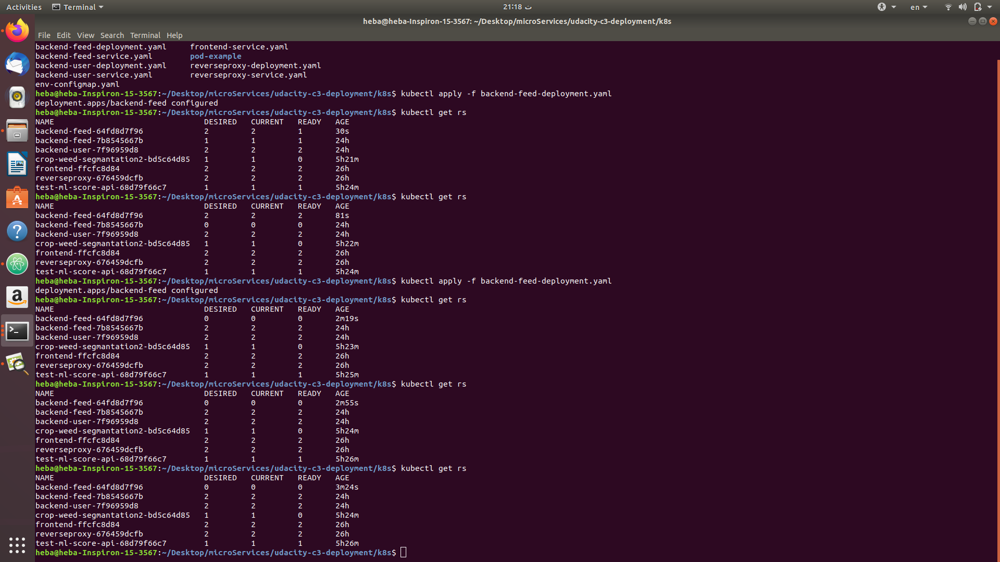
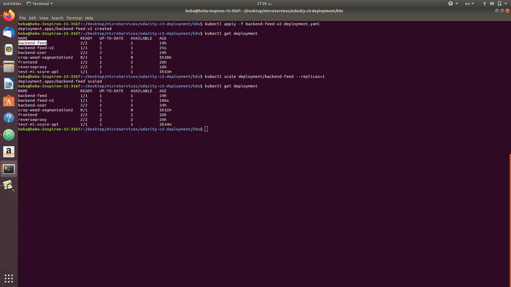
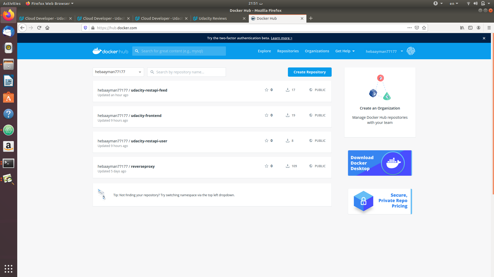
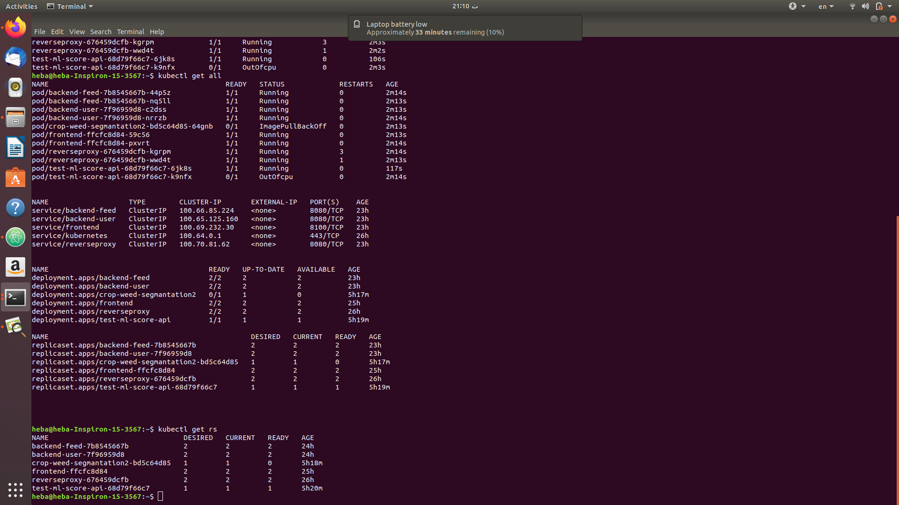
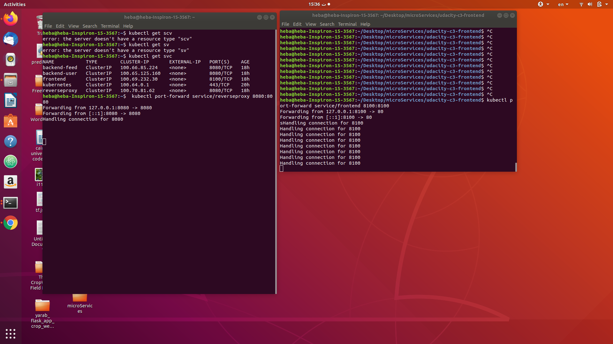

# About the Project - Udagram Image Filtering Microservice
Udagram is a simple cloud application developed alongside the Udacity Cloud Engineering Nanodegree. It allows users to register and log into a web client, post photos to the feed, and process photos using an image filtering microservice. Following are the services involved in this project:

* “user” - allows users to register and log into a web client,
* “feed” - allows users to post photos, and process photos using image filtering
* “frontend” - acts as an interface between the user and the backend-services
* "reverseproxy" - For resolving multiple services running on same port in separate containers

Correspondingly, the project is split into following parts:
1. The RestAPI Feed Backend, a Node-Express feed microservice.
1. The RestAPI User Backend, a Node-Express user microservice.
1. The Simple Frontend - A basic Ionic client web application which consumes the RestAPI Backend.
1. Nginx as a reverse-proxy server, when different backend services are running on the same port, then a reverse proxy server directs client requests to the appropriate backend server and retrieves resources on behalf of the client.  


##  How to setup and deploy the project


### 1. Pull the images
```
docker pull hebaayman77177/udacity-restapi-feed:latest
docker pull hebaayman77177/udacity-frontend:latest
docker pull hebaayman77177/udacity-restapi-user:latest
docker pull hebaayman77177/reverseproxy:latest
```
### 2. To run

configure your environment variable
```
export PATH=$PATH:/usr/local/mysql/bin/
export POSTGRESS_USERNAME=myusername;
export POSTGRESS_PASSWORD=mypassword;
export POSTGRESS_DB=postgres;
export POSTGRESS_HOST=udagramdemo.abc4def.us-east-2.rds.amazonaws.com;
export AWS_REGION=us-east-2;
export AWS_PROFILE=default;
export AWS_BUCKET=udagramdemo;
export JWT_SECRET=helloworld;
```

#### 2-1. In containers on your local machine
from udacity-c3-deployment/docker folder run
```
docker-compose -f docker-compose-build.yaml build --parallel
docker-compose up
```

#### 2-2. In Kubernetes cluster
first Create cluster ,
alter your secrets in env-secret.yaml,aws-secret.yaml

from udacity-c3-deployment/k8s

```
kubectl apply -f backend-feed-deployment.yaml

kubectl apply -f backend-user-deployment.yaml

kubectl apply -f frontend-deployment.yaml

kubectl apply -f reverseproxy-deployment.yaml

kubectl apply -f pod-example/pod.yaml

kubectl apply -f backend-feed-service.yaml

kubectl apply -f backend-user-service.yaml

kubectl apply -f frontend-service.yaml

kubectl apply -f reverseproxy-service.yaml

kubectl apply -f env-secret.yaml

kubectl apply -f aws-secret.yaml

kubectl apply -f env-configmap.yaml

```
then

```
kubectl port-forward service/reverseproxy 8080:8080
kubectl port-forward service/frontend 8100:8100

```
 ### Upgraded via rolling-update
- first i changed the feed deployment

- then deployed it
- then i changed back to the old deployment



 ### A/B deployment of the application
 - i made a new deployment of the feed
 - then deployed it
 - then i scaled down old feed deployment


 


## Screenshots
</n>


 

  

  
